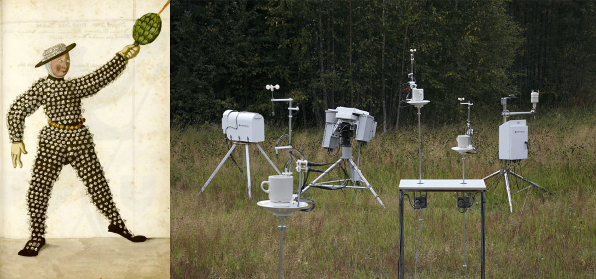

# CHANCE & RANDOMNESS  

> "So much of life, it seems to me, is determined by pure randomness." — Sidney Poitier  

> "I use chance operations instead of operating according to my likes and dislikes." — John Cage  

> "You see you have to get right into it, as you do with any good book, and you must become involved and experience it yourself. Then you will know something and feel something. Let us say that it provides a milieu for your experience but what you bring to it is the biggest ingredient, far more important than what is there." – Alison Knowles  

During this one-day workshop, we'll explore chance and randomness as tools for making art. Through a series of exercises and in the context of lots of examples–from visual art, music, popular culture, science, and technology–we'll investigate the creative potential of letting go of artistic decisions and collaborating with chance and randomness.

Along the way, we'll discuss what happens when, to varying degrees, we remove the artist's hand in favor of mechanisms and processes out of our control. The workshop will culminate in time to explore ways that the ideas we talk about could enter your own creative practice.

*Above: "Dice Man" from 1590 (left) and Agnes Meyer Brandis' ["Global Teacup Network"](http://www.blubblubb.net/tea/index.html) from 2017 (right)*

***

### WORKSHOP MATERIALS  
You can use the section at the top to access the materials we used in this workshop (and a bunch of stuff we don't have time to explore). 

* `Activities`: the exercises we will do together, includes links and further resources  
* `Images`: lots of examples, historical and contemporary  
* `Readings`: required and suggested readings  
* `Resources`: miscellaneous stuff, including a lot of things we didn't have time to cover  

***

### WORKSHOP OUTLINE  
*Tentative and may change depending on interest and how the day progresses; all times EST*  

| TIME | ACTIVITIES |
| ---- | ---------- |
| 12–12.30 | What we're going to do today, introductions |
| 12.30–2 | Drawings made with [gravity](Activities/1-GravityDrawings.md), [instructions](Activities/2-InstructionDrawings.md), and [coins/dice](Activities/3-DiceDrawings.md) |
| 2–2.45 | [White noise listening session](Activities/4-WhiteNoiseListeningSession.md); works exploring noise and order |
| 2.45–3 | Break |
| 3–4 | [Making work with *Oblique Strategies*, creating our own cards](Activities/5-ObliqueStrategies.md) |
| 4–4.45 | [Connecting to your own practice](Activities/6-ConnectingToYourOwnPractice.md); the role of intention and decision-making in artistic practice |

***

### CODE OF CONDUCT  
Since this workshop includes a lot of interaction between all participants, it's important for us to create an environment of inclusion and mutual respect. While together, the perspective of people of all races, ethnicities, gender expressions and gender identities, religions, sexual orientations, disabilities, socieconomic backgrounds, and nationalities will be respected and viewed as a resource and benefit to us all. This doesn't mean we can't disagree, but discussions, critique, and other interactions should be welcoming, inclusive, constructive, and respectful.

If at any point you feel that someone is violating this code of conduct, please let me (via email or DM) or Transart Institute know.

Any suggestions for further diversifying workshop materials are encouraged!

